<h1 align="center">Quadruped ROS2 Control</h1>

<p align="center">
  <audio controls src="video/宇树Go2实战避坑.mp3">
    Your browser does not support audio playback. Please open the audio file <a href="video/宇树Go2实战避坑.mp3">here</a>.
  </audio>
</p>

<p align="center">
  
</p>

<p align="center">
  <em>Unitree Go2 based simulation, controller debugging notes, and ROS 2 integration work.</em>
</p>

<p align="center">
  <a href="./readme.md">简体中文</a> | <strong>English</strong>
</p>

> This is a practical English guide built on top of the original `Quadruped ROS2 Control` project. At this stage, the modifications mainly start from the `Unitree_guide` related part and are organized together with `Unitree Go2` simulation and debugging experience. For detailed modification notes, see [Modification Notes](./readme_fixed_EN.md). Later updates will gradually extend to modifications and optimizations for other controllers as well.

---

## Branch Version
Before continuing to expand the current project, it is worth introducing an important branch version first: [`quadruped_ros2_control_unitree_guide` on the `debug` branch](https://github.com/yanyuze1/quadruped_ros2_control_unitree_guide/tree/debug?tab=readme-ov-file). This branch extracts the `unitree_guide` controller related content separately, making it easier to inspect, debug, and analyze that part in a focused way. It also adds some debug-oriented content, which helps locate key parts more efficiently during troubleshooting, controller state observation, and later optimization.

## Preface
If you are also working on quadruped robot control, simulation, and parameter tuning, I hope this record helps you get started faster and avoid a few detours. Thanks to the [Quadruped ROS2 Control](https://github.com/legubiao/quadruped_ros2_control/tree/humble) project for providing a solid foundation. This project is further modified and organized on top of it, and the current work uses the `Unitree_guide` branch. The following content focuses on the problems encountered during real debugging and the ideas used to solve them. I hope it keeps you interested while reading and is genuinely useful when you need it.

## Project Structure Chart


## Quick Start
### Software Preparation
- Install `unitree_sdk2`
- Install `Unitree_mujoco`
- Install `Unitree_guide`

#### unitree_sdk2
```bash
git clone https://github.com/unitreerobotics/unitree_sdk2.git
cd unitree_sdk2/
mkdir build
cd build
cmake ..
sudo make install
```
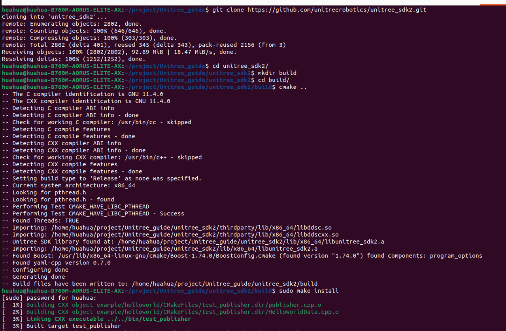

#### Unitree_mujoco
```bash
sudo apt install libyaml-cpp-dev libspdlog-dev libboost-all-dev libglfw3-dev
git clone https://github.com/unitreerobotics/unitree_mujoco.git
```
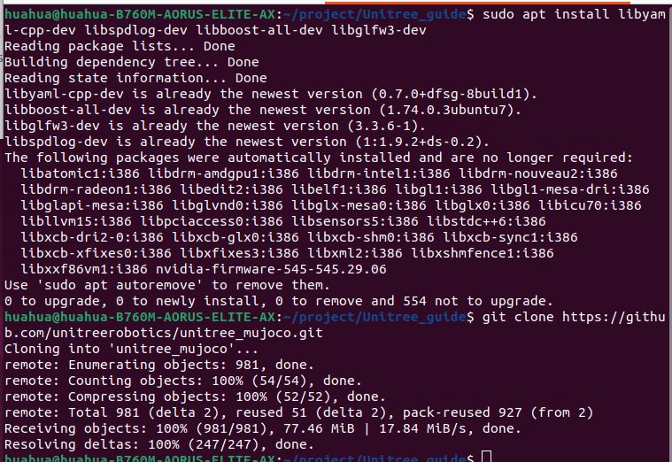

Find and download MuJoCo version `mujoco-3.3.6` from the MuJoCo releases page. After downloading it, extract it to the `unitree_mujoco/simulate` directory. Remember to rename the extracted folder to `mujoco`. The official method uses a symbolic link, which is different from the method used here.

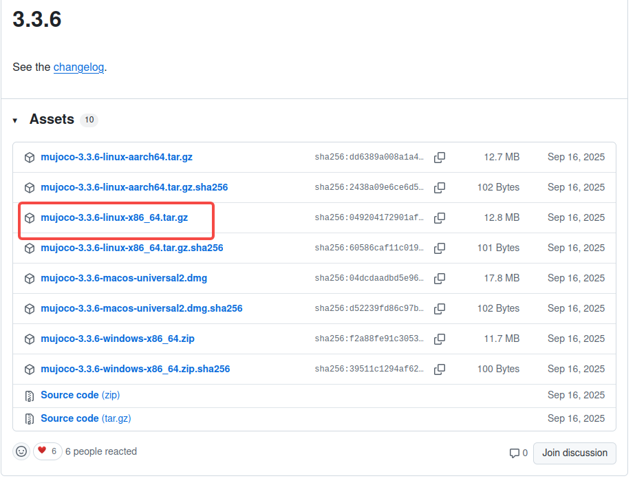
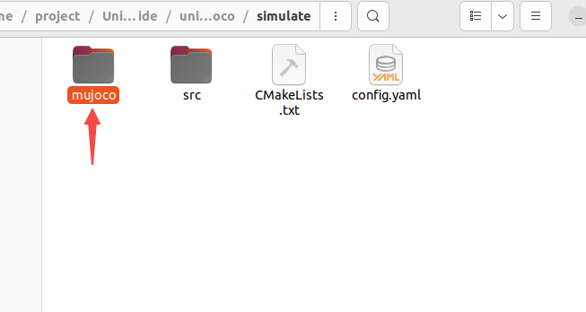

```bash
cd unitree_mujoco/simulate
mkdir build && cd build
cmake ..
make -j4
```
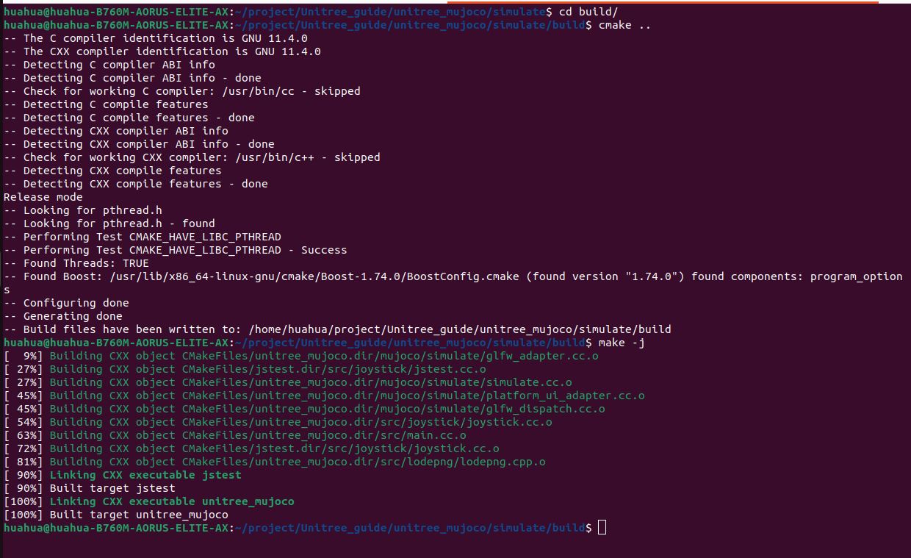

If compilation fails because MuJoCo cannot be found when using the non-symbolic-link method above, you can try the method used in `unitree_mujoco`, or directly install MuJoCo into the system as shown below.

```bash
git clone https://github.com/google-deepmind/mujoco.git
cd mujoco
git checkout 3.3.6
mkdir build && cd build
cmake ..
make -j
sudo make install
```

Use the following command to start the simulator for testing. Note that CycloneDDS can easily cause simulation startup failures when using the `lo` network interface, because the local loopback interface in CycloneDDS does not support multicast. It is recommended to explicitly use Fast DDS, or use another network interface with CycloneDDS. CycloneDDS can also cause inconvenience in later use, so it is recommended to remove it for this project.

```bash
./unitree_mujoco -r go2
```
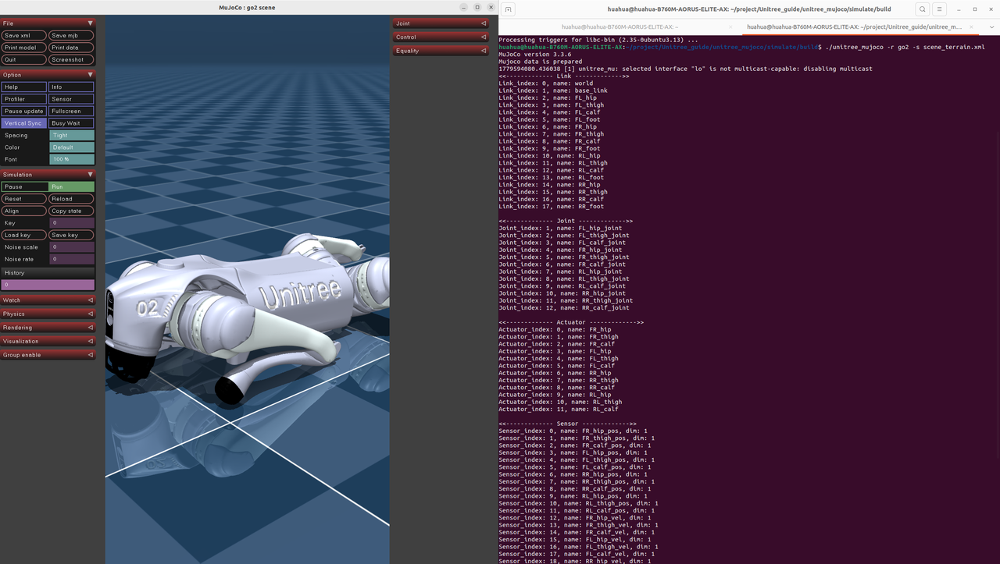

#### Unitree_guide
```bash
git clone https://github.com/yanyuze1/quadruped_ros2_control_unitree_guide.git
cd quadruped_ros2_control_unitree_guide
rosdep install --from-paths src --ignore-src -r -y
```
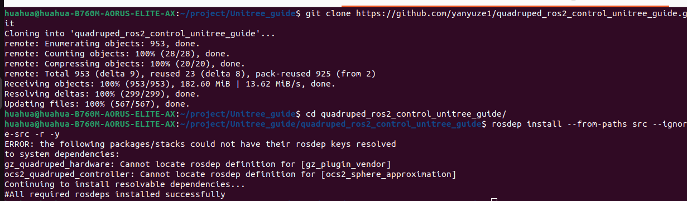

For the simulation part, use the following build command.
```bash
colcon build --packages-up-to unitree_guide_controller go2_description keyboard_input hardware_unitree_mujoco --symlink-install
```
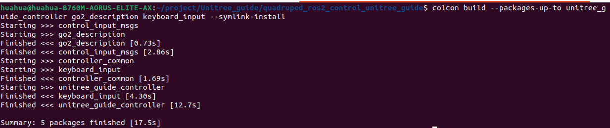

### Usage
- Simulation usage
- Real robot usage
- Docker usage

#### Simulation Usage
- Start the `Unitree_mujoco` simulator
```bash
cd unitree_mujoco/simulate/build/
./unitree_mujoco -r go2
```
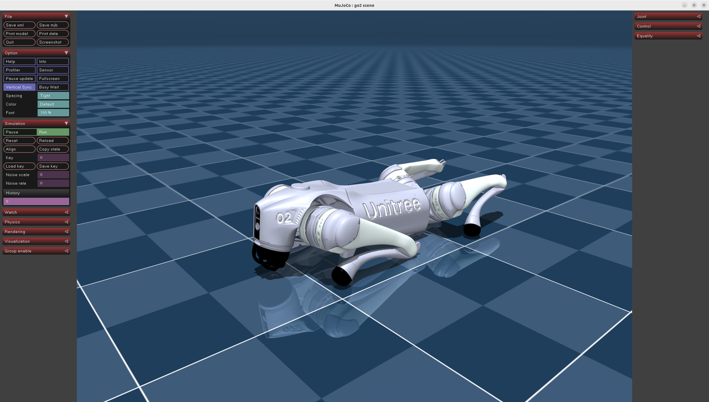

- Start the `Unitree_guide` controller

Modify `ros2_control.xacro` under `quadruped_ros2_control_unitree_guide/src/quadruped_ros2_control/descriptions/unitree/go2_description/xacro`. Note that the domain needs to be aligned between `ros2_control.xacro` and `unitree_mujoco/config.yaml`.
```bash
<hardware>
    <plugin>hardware_unitree_mujoco/HardwareUnitree</plugin>
    <param name="domain">0</param>
    <param name="network_interface">enp109s0</param>
    <param name="show_foot_force">true</param>
</hardware>
# Change to
<hardware>
    <plugin>hardware_unitree_mujoco/HardwareUnitree</plugin>
    <param name="domain">1</param>
    <param name="network_interface">lo</param>
    <param name="show_foot_force">true</param>
</hardware>
```
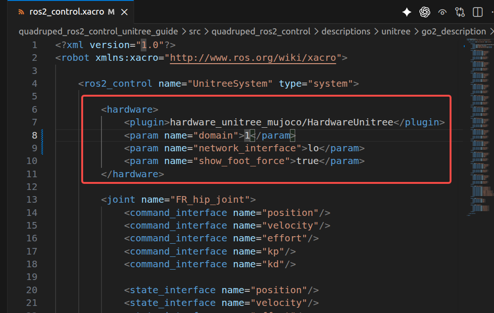

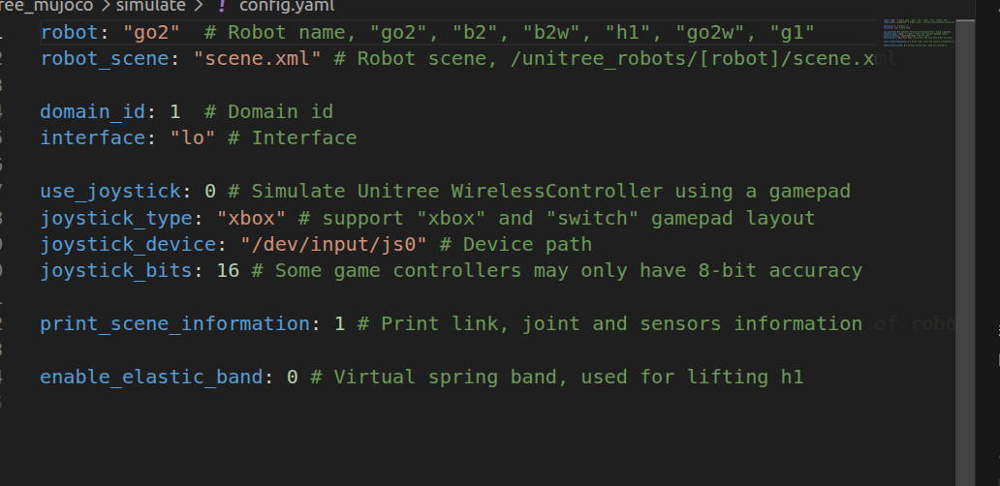

After the modification, build the `go2_description` package.
```bash
cd quadruped_ros2_control_unitree_guide/
colcon build --packages-up-to go2_description --symlink-install
```
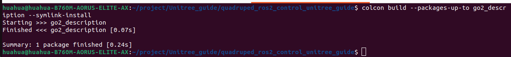

After the build is complete, start the controller. If it starts successfully, an RViz2 window will appear.
```bash
source install/setup.bash
ros2 launch unitree_guide_controller mujoco.launch.py
```
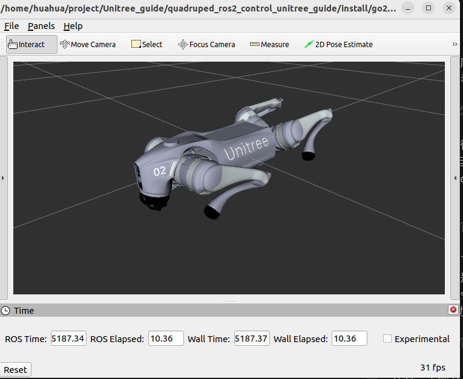

Start the remote controller. The simulation supports keyboard and gamepad controllers. The current ROS 2 version of `Unitree_guide` does not support `cmd_vel` mode yet, and it will be added later.

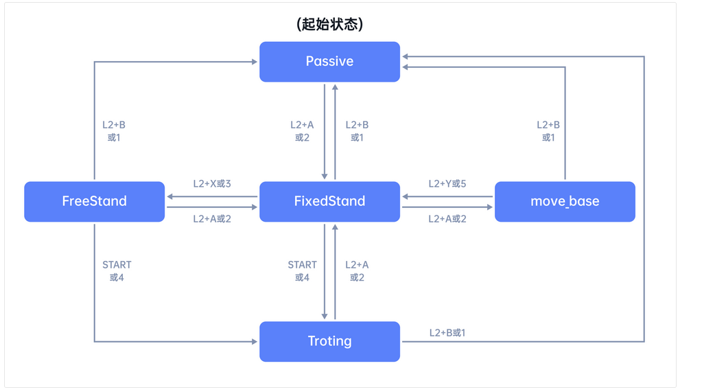

```bash
cd quadruped_ros2_control_unitree_guide/
source install/setup.bash
ros2 run keyboard_input keyboard_input    # Keyboard remote controller
```
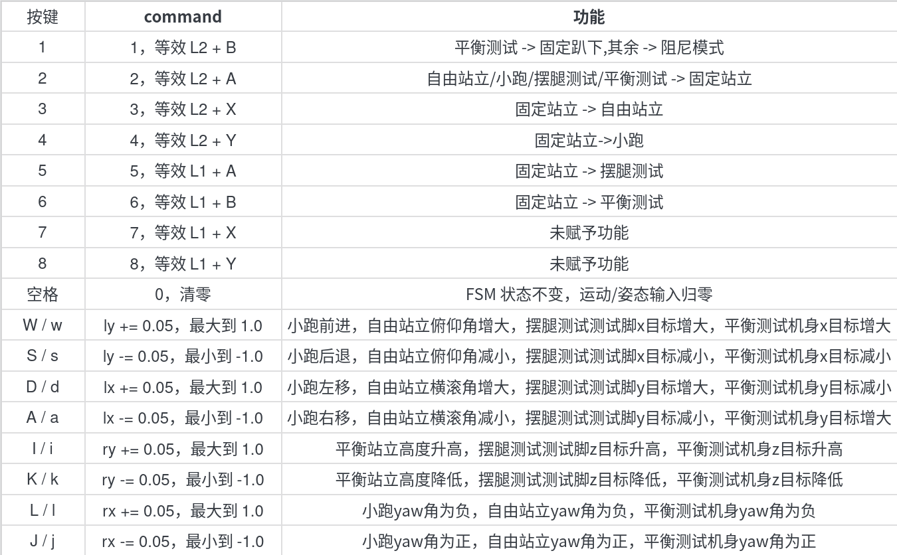


- Gamepad controller
```bash
cd quadruped_ros2_control_unitree_guide/
colcon build --packages-up-to joystick_input --symlink-install
source install/setup.bash
ros2 launch joystick_input joystick.launch.py
```

#### Real Robot Usage
For the real robot part, follow Biao's real robot deployment method and change the interface to the corresponding one. When starting the controller, remember to use the mobile app to turn off the official controller. If the official controller is not turned off, two controllers will compete for control of the robot dog at the same time, which can cause significant damage to the motor joints.
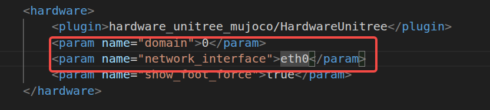

```bash
ros2 launch unitree_guide_controller mujoco.launch.py
```


#### Docker Image
The configured Docker image has already been uploaded to the Docker image repository. If you need to use it independently, you can configure and use it directly. Note: this image only simplifies the environment configuration. The package build still needs to be completed by yourself.
```bash
docker pull huahuajiang/unitree_guide:ros2-humble
```
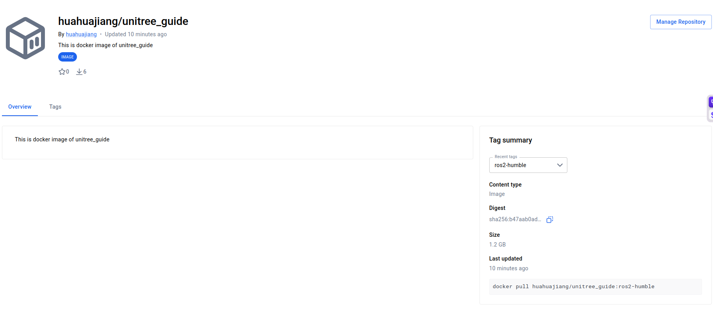

After pulling the Docker image, use the following command to complete the environment configuration.
```bash
docker run -it \
  --env DISPLAY=${DISPLAY} \
  --env NVIDIA_DRIVER_CAPABILITIES=all \
  --env QT_X11_NO_MITSHM=1 \
  --env USER_ID=${USER_ID:-1000} \
  --env GROUP_ID=${GROUP_ID:-1000} \
  --device /dev/snd:/dev/snd \
  --device /dev/dri:/dev/dri \
  --device /dev/input:/dev/input \
  --volume /tmp/.X11-unix:/tmp/.X11-unix \
  --volume /home/$(whoami):/home/ROS2 \
  --gpus all \
  huahuajiang/unitree_guide:ros2-humble
```
After completing the software builds above inside the Docker container, you can directly start simulation and real robot control.

## Acknowledgements
Thanks to [Quadruped ROS2 Control](https://github.com/legubiao/quadruped_ros2_control/tree/humble) for providing a solid engineering foundation. This project is further modified and organized on top of it. Thanks also to [Unitree_guide](https://support.unitree.com/home/zh/Algorithm_Practice/about_unitreeguide) for providing the complete theoretical foundation. The theory used in this project comes entirely from it.
